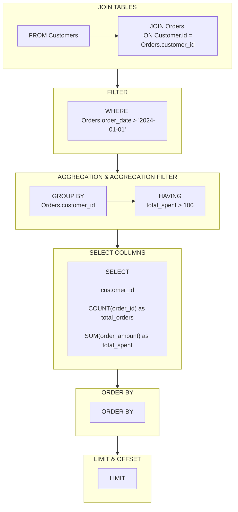

# Introduction to SQL

## Execution order of SQL query
```
SELECT      customer_id, COUNT(order_id) as total_orders, 
			SUM(order_amount) as total_spent
FROM        Customers
JOIN        Orders
ON          Customers.id = Orders.customer_id
WHERE       Order_Date >= '2024-01-01'
GROUP BY    customer_id
HAVING      total_spent >= 1000
ORDER BY    total_spent DESC
LIMIT       10;
```
1. FROM - The Customers table is selected
2. JOIN ON - The selected Customers table is joined with another table Orders using the common Customers.id and Orders.customer_id columns. Indexing by these join columns can significantly improve the performance of the JOIN operation. 
3. WHERE - Filters the combined\\merged data table by applying the condition defined in WHERE predicate. It is important to write a **Sargable** (Search ARGument ABLE) query to leverage indexes effectively during this operation. 
4. GROUP BY - 
5. HAVING - 
6. SELECT - Defines and selects which columns we want in our result set
7. ORDER BY - Use appropriate indexes to speed up sorting process
8. LIMIT & OFFSET - 



### SARGABLE Queries

